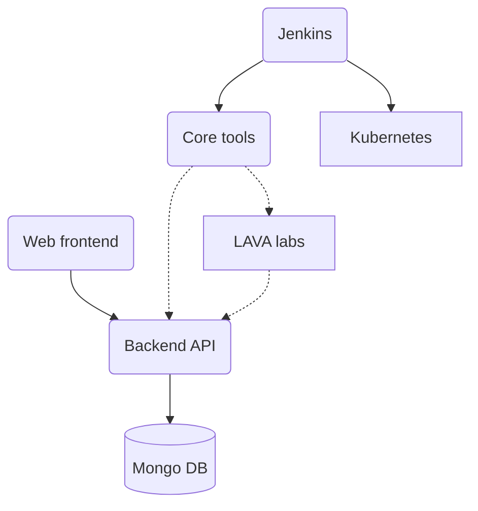

> **Note:** This section describes the legacy KernelCI architecture.  Please
> see the [API transition timeline](/blog/posts/2023/api-timeline/) blog post
> for more details about when it will be premanently retired.

## KernelCI native tests

KernelCI native tests are orchestrated using the following components:

* [Core tools](../core) contain all the primitive functions implemented in
  Python as well as the system [configuration](../core/config).  This is how
  kernels are built, test definitions are generated etc.
* [kernelci-backend](https://github.com/kernelci/kernelci-backend) which
  provides an API on top of Mongo DB to store all the data.  It also performs
  some post-processing such as generating email reports, detecting regressions
  and triggering automated bisections.
* [kernelci-frontend](https://github.com/kernelci/kernelci-frontend) which
  provides a web dashboard such as the one hosted on
  [linux.kernelci.org](https://linux.kernelci.org).  This makes use of the backend API
  to retrieve results.
* [kernelci-jenkins](https://github.com/kernelci/kernelci-jenkins) to run a
  [Jenkins](https://www.jenkins.io/) instance and orchestrate all the builds
  and tests being scheduled.  It also relies on
  [Kubernetes](https://kubernetes.io/) provided by [Microsoft
  Azure](https://azure.microsoft.com/) and [Google Compute
  Engine](https://cloud.google.com/) to run all the kernel builds.
* [Test labs](../labs), typically using LAVA but not only, are hosted by people
  and organisations outside of the KernelCI project.  They are however
  connected to KernelCI services to run tests and send results directly to the
  backend.

There are several [instances](../instances) hosted by the KernelCI project, for
different needs as explained in the documentation.  Each instance is made up of
all the components listed above.  It's possible for anyone to set up their own
private instance too.  However, developers typically don't need to set up a
full instance but only the components they need to make changes to.  Here's how
they all relate to each other:

Dotted lines are optional dependencies, and solid lines are required ones.  To
put this in words:

The Core tools can be used on their own on the command line without anything
else installed.  They may be used to build kernels locally, submit data to a
Backend API, or schedule jobs in test labs such as LAVA.  Jobs may be run
without any Backend API, but if there is one then results can be sent to it.
Then Jenkins uses Core tools to do all that, via Kubernetes for kernel builds.
Finally, the Web frontend uses a Backend API but nothing depends on it (apart
from end users) so it's entirely optional.
