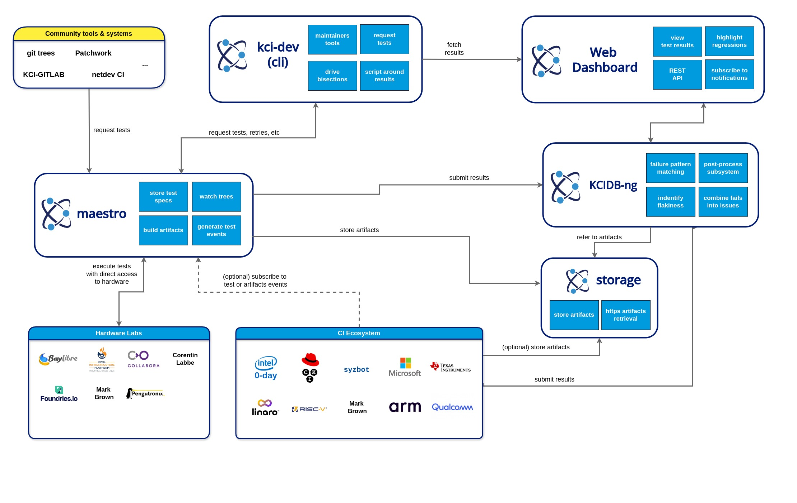

[[download svg diagram](kernelci-architecture.svg)]

## Main Components

### [kci-dev](/components/kci-dev)

[kci-dev](/components/kci-dev) is a stand-alone tool for Linux Kernel developers and maintainers to interact with KernelCI directly from their terminal. It is great for There is full documentation available at [kci.dev](https://kci.dev) and a [PyPI package](https://pypi.org/project/kci-dev/). Source code is available on [GitHub](https://github.com/kernelci/kci-dev).

### [Web Dashboard](https://dashboard.kernelci.org/)

A new [web dashboard](https://dashboard.kernelci.org/) has been developed to allow users to easily visualise results from KernelCI testing and setup email notifications. Development, issues and feature requests are all being tracked on [GitHub](https://github.com/kernelci/dashboard).

### [Maestro](/components/maestro)

The middle left box of this picture shows Maestro. While Maestro is only one software system, architecturally its flow has 2 parts: (1) triggering builds and list of tests to run on each platform and (2) driving such tests.

Maestro has a [pipeline-based](/components/maestro/pipeline) design and an [API](/components/maestro/api/) that allow other systems and tools to interact with it to subscribe to events (such as new build/test triggers) or send patches to be tested by the KernelCI infrastructure.

### [KCIDB-ng](/components/kcidb)

KernelCI has a common database for tests results. CI systems producing their own kernel builds and running their own tests can submit results to [KCIDB-ng](/components/kcidb).  Please take a look at this blog post for a comprehensive description: [Introducing Common
Reporting](https://kernelci.org/blog/2020/08/21/introducing-common-reporting/).

### Storage

When running tests in a CI environment, the logs and other artifacts produced during the test execution needs to be saved and made available for posterior analysis. With that in mind, we created [kernelci-storage](https://github.com/kernelci/kernelci-storage) that run as a http server offering hosting for the community artifacts. If you need storage for your artifacts, talk to us and we can setup an account for you.

### Hardware lab

The KernelCI community members hosts a few hardware labs for kernel testing. These labs are managed by independent community members. The KernelCI project does not run or manage any hardware lab.

KernelCI hardware labs receives test request directly from KernelCI's Maestro, so they need to be accessible from the internet and tokens handed to KernelCI sysadmin. Today, KernelCI supports only LAVA based labs.

For labs who need to be behind a firewall, the alternative option is to setup them as part of the CI Ecosystem described below. Check our [platform testing](/intro/platform-testing) page for more info.

### CI Ecosystem

Any CI/test system can be part of KernelCI by receiving triggers from Maestro and submitting their data to KCIDB-ng. Receiving triggers is optional for CI/test system, as many have their own trigger configuration already for building and testing kernels.

Sometimes companies who want to add their hardware to be tested by KernelCI will setup a CI system to overcome limitations imposed by internal IT policies.

## Integrations with other systems

### netdev-CI

A bridge between KernelCI's Maestro and the [Netdev CI system](https://github.com/linux-netdev/nipa/wiki/Netdev-CI-system) is available for executing networking testing on the hardware available in KernelCI. Maestro monitors the netdev CI test branches, builds and test the kernel on hardware added in KernelCI labs for networking testing and report the results back to Netdev CI.

### Patchwork (not available yet)

The patchwork integration is high up in the list for many maintainers. The KernelCI community wants to enable that support, but no spare cycles were available for that yet.

## Talk to us

If you have any queries about our architecture, please [reach out](/contacts).

