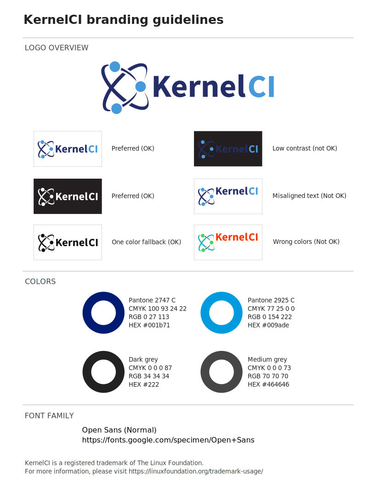

Our branding guidelines are available for download as: [SVG](kernelci_brand.svg) | [PDF](kernelci_brand.pdf)

## Logo files

KernelCI logo (color) [SVG](kernelci-logo-color.svg) | [PNG](kernelci-logo-color.png)

KernelCI logo (black) [SVG](kernelci-logo-black.svg)

KernelCI logo (white) [SVG](kernelci-logo-white.svg)

### Legal notice

By using the KernelCI trademark and logo, you agree to follow these guidelines as well as the trademark usage statement of The Linux Foundation. These guidelines apply to your use of the KernelCI trademark and logo.

The KernelCI Advisory Board reserves the right to grant or deny any permission at its sole discretion and for any reason. If you have any questions about these guidelines, please contact [kernelci-members@groups.io](mailto:kernelci-members@groups.io).

KernelCI is a registered trademark of The Linux Foundation. For more information and statement, please visit https://linuxfoundation.org/trademark-usage/